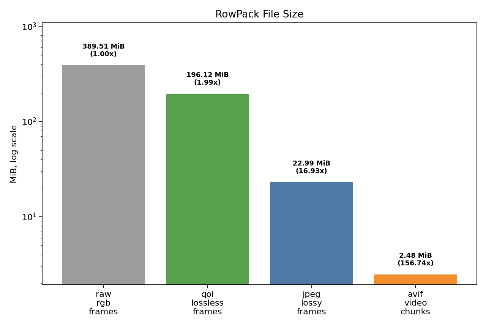
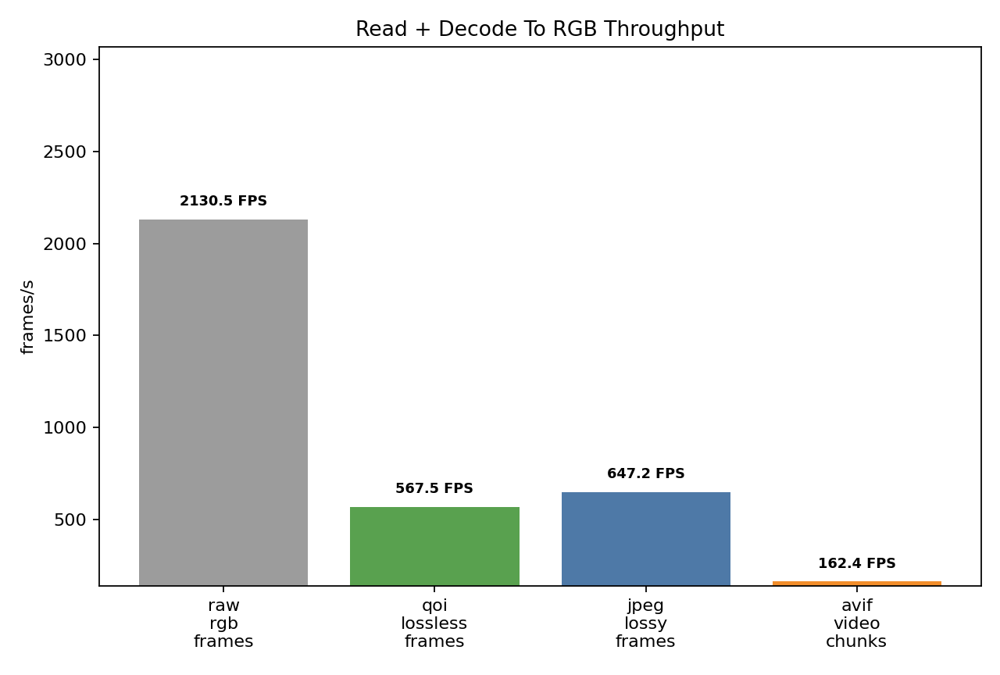

# RowPack: Faster than Parquet but compression as good as its best, with image/video encoding for dataset capture built-in




RowPack is a row-major dataset container for multimodal training workloads.
It is built for the pattern VLM training usually wants: sample a random window,
read a small block of neighboring rows, decode images, tokenize text, and feed
the batch without spending most of the step waiting on the loader.

Parquet is excellent for analytics, column scans, and ecosystem compatibility.
RowPack aims at a different hot path: training-time row/window access.

## Why It Is Useful

- Row-major layout enables speed by matching random-access shuffle training with better throughput than column-major
  Parquet files.
- Header-only C++ with Python bindings and PyTorch dataloader integration.
- Converters to port Parquet or JSONL files to Rowpack format. Includes method to chunk long inputs across multiple rows with searchable index.
- Friendly examples to get you started quickly.
- Modern libraries for speed and utility:
  - [nanobind](https://github.com/wjakob/nanobind) (BSD3) for fast Python bindings.
  - [CISTA](https://github.com/felixguendling/cista) (MIT) cast-mode payloads avoid rebuilding large Python dictionaries.
  - [LZAV](https://github.com/avaneev/lzav) (MIT) block compression gives good size reduction with very fast decompression.
  - [QOI](https://github.com/phoboslab/qoi) (MIT) for fast lossless image decoding and storage.
  - [STB](https://github.com/nothings/stb) (MIT) image decode and JPEG writing.
- The Python loader can hand back ready-to-shape byte buffers, so users can go
  straight to `np.frombuffer(...).reshape(h, w, c)`, or let the
  [PyTorch dataloader](torch_dataset.py) take care of batching.

In the current `mm_infographic_vqa` random-block benchmark, RowPack with LZAV
high-ratio blocks compresses close to Parquet GZIP/Brotli size while keeping
throughput near the uncompressed row-major baseline and well ahead of the
slower Parquet codecs.

## Portable and Self Contained

The native build is self-contained under `third_party/`, and the C++ writer is
header-only for easy embedding. The bundled dependencies and this repository
are permissively licensed.

## Build

From the repository root:

```bash
cmake -S . -B build
cmake --build build --config Release
ctest --test-dir build -C Release --output-on-failure
```

That builds the `rowpack_native` Python extension, builds the C++ example, and
runs the C++/Python smoke tests. Advanced layouts, including parent-directory
builds and explicit Python interpreter selection, are covered in
[docs/build-details.md](docs/build-details.md).

## Quick Examples

Create and read a tiny RowPack file with these verbose examples read further down for deeper explanation if interested.:

```bash
python3 examples/create_rowpack_direct.py --output build/examples/robot_demo.rowpack
python3 examples/read_rowpack.py --input build/examples/robot_demo.rowpack
```

Add LZAV compression and CISTA format for speed.

```bash
python3 examples/create_rowpack_direct.py \
  --output build/examples/robot_demo_native.rowpack \
  --payload-format cista \
  --block-codec lzav_hi \
  --native-module-dir build
```

Record dataset from ROS topics:

```bash
python3 -m rowpack.ros2_capture --config examples/capture_config.json
```

## Convert Parquet To RowPack

RowPack includes a generic Parquet converter. It streams Parquet batches,
turns each Parquet row into one RowPack row, and preserves ordinary columns as
JSON-compatible fields. Columns named `image`, `images`, `img`, or `imgs` are
treated as image payloads automatically; for other schemas, pass
`--image-column`.

```bash
python3 -m rowpack.convert_parquet \
  --input data/train.parquet \
  --output build/datasets/train.rowpack \
  --payload-format cista \
  --block-codec lzav_hi \
  --native-module-dir build \
  --image-column image \
  --name-column id \
  --overwrite
```

The converter requires `pyarrow`:

```bash
python3 -m pip install pyarrow
```

Useful options:

- `payload-format cista`: choose how each row is serialized inside RowPack.
  `json` is easy to inspect and useful for debugging. `cista` is the fast path:
  it stores typed native payloads that the C++ extension can read directly,
  avoiding a lot of Python object reconstruction during training.
- `image-column image`: move this Parquet column into RowPack's `images`
  payload list. Hugging Face-style image structs such as `{bytes, path}` work,
  as do raw encoded bytes. Repeat the option for multiple image columns.
- `block-codec lzav_hi`: choose block compression. Options are `none`,
  `lzav_default`, and `lzav_hi`. `none` is the pure layout baseline,
  `lzav_default` favors faster conversion, and `lzav_hi` spends more time while
  writing to get the smallest RowPack files. `lzav_hi` is the recommended
  default for dataset publishing; both LZAV modes are designed for very fast
  decompression during training.
- `rows-per-block 32`: compresses 32 rows into one block, a good default to
  balance compression ratio with shuffled random-window read performance.
- `name-column id`: use a stable Parquet column as the RowPack row name, so
  rows can be addressed by name later.
- `index-column document_id`: build a searchable document index in metadata.
  This groups contiguous rows with the same document id into one range, which
  is useful when a RowPack contains many books, articles, episodes, or robot
  runs.
- `index-label-column title`: add extra searchable labels to the document
  index. Repeat it for fields such as title, author, ISBN, source URL, or
  dataset split.
- `columns` and `drop-column`: limit which Parquet columns are read or stored.
  Non-image binary columns are preserved as base64 JSON wrappers so generic
  conversion does not silently throw bytes away.

The direct authoring example in [examples/create_rowpack_direct.py](examples/create_rowpack_direct.py)
uses the same writer API a Parquet converter would use.

For fully custom image handling, use `RowPackDatasetBuilder` directly. That is
where modes such as `raw_rgb`, `qoi_lossless`, and `jpeg_lossy` are available.

## Convert JSONL To RowPack

JSONL is common for text and instruction datasets. RowPack includes a streaming
converter that reads one JSON object per line and writes one RowPack row per
JSONL row by default:

```bash
python3 -m rowpack.convert_jsonl \
  --input examples/sample_books.jsonl \
  --output build/datasets/sample_books.rowpack \
  --columns meta text \
  --index-column meta.short_book_title \
  --index-label-column meta.url \
  --payload-format json \
  --block-codec none \
  --overwrite
```

The local [examples/sample_books.jsonl](examples/sample_books.jsonl) file is a
tiny book-shaped corpus with nested `meta` and `text` fields. The command above
keeps those two columns, builds a searchable document index from
`meta.short_book_title`, and stores the result in plain JSON payloads so the
file is easy to inspect while learning the format.

Useful options mirror the Parquet converter:

- `columns question answer`: keep only selected JSON keys.
- `drop-column metadata`: remove a noisy key from every row.
- `image-column image`: move image bytes/paths/structs into RowPack's `images`
  payload list.
- `name-column id`: use a stable JSON key as the RowPack row name.
- `index-column book_id`: group rows into searchable document ranges.
- `index-label-column title`: make human-friendly titles searchable without
  requiring them to be the canonical key.

For production conversions, the faster default is usually:

```bash
python3 -m rowpack.convert_jsonl \
  --input examples/sample_books.jsonl \
  --output build/datasets/sample_books_lzav.rowpack \
  --columns meta text \
  --index-column meta.short_book_title \
  --index-label-column meta.url \
  --payload-format json \
  --block-codec lzav_hi \
  --rows-per-block 128 \
  --overwrite
```

For generic text-heavy JSONL, `payload-format json` is still a strong baseline:
the source fields stay natural, and `lzav_hi` does the real compression work on
row-major blocks. Use `payload-format cista` when your rows follow RowPack's
native multimodal shape (`data`, `images`, and compact `extra_json`) or when you
want to benchmark native payload decoding.

For very long fields, use opt-in splitting:

```bash
python3 -m rowpack.convert_jsonl \
  --input examples/sample_books.jsonl \
  --output build/datasets/sample_books_split.rowpack \
  --columns meta text \
  --index-column meta.short_book_title \
  --index-label-column meta.url \
  --split-column text \
  --split-max-chars 2048 \
  --split-overlap-chars 128 \
  --overwrite
```

This is feasible and often useful, but it should be explicit. When a field is
split, RowPack writes the first chunk with the rest of the source row, then
writes continuation rows that contain only the split field chunk plus
`_rowpack_split` metadata. For example, a row shaped like `A, B, C` can become
`A, B1, C`, then `B2`, then `B3`. The continuation rows record the source file,
source line, part index, total part count, and split columns so training code
can decide whether to consume them as independent samples or stitch them back
together.

### Large JSONL Conversion

A parallel converter script is available for large scale JSONL conversions, and
the benchmark script reports both creation speed and training-style read speed.
Creation speed is nice, but read speed is the number to optimize for LLM/VLM
training.

```bash
python3 benchmarks/benchmark_books_jsonl_conversion.py \
  --input your_books.jsonl \
  --output-dir results/books_jsonl_conversion_benchmark_300 \
  --max-input-lines 300 \
  --payload-format json \
  --block-codec lzav_hi \
  --workers 2 4 8 \
  --rows-per-block 64 128 \
  --split-max-chars 4096 8192 \
  --read-pattern random_block \
  --read-block-size 128 \
  --read-workers 1 4 \
  --read-repeats 3 \
  --overwrite
```

This writes `summary.csv`, `summary.md`, charts, and temporary benchmark
`.rowpack` files under the output directory. The summary includes:

- write throughput: how fast the converter creates the file.
- read throughput: how fast RowPack reads decoded rows using the selected
  access pattern.
- source-to-RowPack compression ratio: how much smaller the final `.rowpack`
  is than the JSONL input prefix.
- block compression ratio: how much LZAV shrinks the row-major block payloads.

LZAV compression/decompression is applied per block. To use more CPU while
reading, use multiple independent loader workers that read different windows;
the benchmark's `--read-workers` flag models that. Once the read-speed and size
tradeoff looks stable, use the same parameters on the full file:

```bash
python3 -m rowpack.convert_jsonl_parallel \
  --input your_books.jsonl \
  --output build/datasets/books.rowpack \
  --columns meta text \
  --index-column meta.short_book_title \
  --index-label-column meta.url \
  --split-column text \
  --split-max-chars 8192 \
  --split-overlap-chars 128 \
  --rows-per-block 128 \
  --payload-format json \
  --block-codec lzav_hi \
  --workers 4 \
  --overwrite
```

The current parallel converter parallelizes block serialization and LZAV
compression. JSON parsing and splitting remain in the main process, which keeps
the implementation dependency-light and reproducible; a future C++ JSONL
frontend can push more of that work into native code if parsing becomes the
bottleneck on very large files.

If your native build is somewhere unusual, add
`--native-module-dir path/to/build/Release` or set `ROWPACK_NATIVE_DIR`.

## Searchable Document Indexes

RowPack can store optional search indexes in metadata. The built-in converter
index is deliberately small: it is a document/range catalog, not a full-text
engine. Each entry says "this book/article/run starts at row N and spans M
rows", plus searchable labels and aliases.

For a corpus with many books:

```bash
python3 -m rowpack.convert_jsonl \
  --input examples/sample_books.jsonl \
  --output build/datasets/books.rowpack \
  --columns meta text \
  --index-column meta.short_book_title \
  --index-label-column meta.url \
  --payload-format cista \
  --block-codec lzav_hi \
  --native-module-dir build \
  --overwrite
```

Read it back by key, title, author, or alias:

```python
from rowpack import RowPackReader

with RowPackReader("build/datasets/books.rowpack", native_module_dir="build") as reader:
    matches = reader.find_index_entries("moby", limit=5)
    book_rows = reader.read_index_entry(matches[0])
```

The same flags are available on `rowpack.convert_parquet`. When JSONL long-field
splitting is enabled, continuation rows remain inside the same document range,
so `read_index_entry(...)` returns all chunks for that document.

## Create RowPack Directly

RowPack can also be used as the dataset recording format. This is the path for
robots, simulators, data generation jobs, or any process that wants to append
rows online instead of converting from Parquet after the fact.

```bash
python3 examples/create_rowpack_direct.py --output build/examples/robot_demo.rowpack
```

The runnable source is [examples/create_rowpack_direct.py](examples/create_rowpack_direct.py).
`RowPackDatasetBuilder` defaults to `payload_format="cista"` and
`block_codec="lzav_hi"`. That means rows are serialized into compact native
payloads, then 32-row windows are compressed together by default. If you want a
debuggable file first, use `payload_format="json"` and `block_codec="none"`.

Image options:

- `encoded`: store source JPEG/PNG/WebP bytes as-is. Best when your source is
  already compressed.
- `raw_rgb`: store packed uint8 pixels with shape metadata.
- `qoi_lossless`: store raw RGB/RGBA pixels through QOI. Best for lossless
  source images when fast decode matters.
- `jpeg_lossy`: encode raw pixels through native STB JPEG writing. Best for
  camera streams where a small visual loss is acceptable.

Generic binary attachments are supported through `files`. This is the right
lane for AVIF/AV1 chunks, MP4 clips, calibration dumps, sensor logs, meshes,
or any other file-like payload that should stay as bytes instead of being
base64-expanded inside JSON:

```python
from rowpack import RowPackDatasetBuilder

with RowPackDatasetBuilder(
    "build/examples/sample_avif_chunks.rowpack",
    payload_format="json",
    block_codec="none",
    overwrite=True,
) as builder:
    builder.append_video_chunk_row(
        stream="front_camera",
        chunk={"bytes": open("examples/sampleavif.avif", "rb").read(), "name": "sampleavif.avif"},
        chunk_index=0,
        codec="avif",
        mime_type="image/avif",
        start_timestamp_ns=0,
        end_timestamp_ns=15_000_000_000,
    )
```

The runnable version is [examples/create_avif_chunks.py](examples/create_avif_chunks.py):

```bash
python3 examples/create_avif_chunks.py \
  --input examples/sampleavif.avif \
  --output build/examples/sample_avif_chunks.rowpack \
  --overwrite
```

AVIF is an image container that can also hold image sequences/animations. For
longer camera streams, RowPack treats each encoded AVIF/AV1 chunk as a binary
continuation row. That avoids pretending every frame is an independent training
sample while still letting a loader seek to chunk boundaries.

RowPack has two raw-frame-to-chunk encoder paths:

- `encoder="libavif"`: native RowPack binding over bundled/system libavif.
  This writes animated AVIF chunks directly from RGB frames and can decode AVIF
  chunks back to raw RGB frames. RowPack's default native build uses rav1e for
  encode and dav1d for decode, avoiding AOM's Perl requirement. If NASM/YASM is
  missing, the bundled rav1e and dav1d builds fall back to portable non-ASM
  paths. Install NASM later if you want faster AV1 encode/decode. Build it with
  `-DROWPACK_ENABLE_LIBAVIF=ON`; details are in
  [docs/build-details.md](docs/build-details.md#native-libavif-backend).
- `encoder="ffmpeg"`: uses the system ffmpeg executable. This remains useful
  for H.264/H.265 and for machines where AV1 codec dependencies are not built.
- `encoder="auto"`: use native libavif for AVIF. If the native AVIF module is
  not built or not found, RowPack raises a direct build/search-path error
  instead of silently trying ffmpeg. Use `--allow-ffmpeg-avif-fallback` only
  when you intentionally want the system ffmpeg path.

If OpenCV is installed, the webcam example is a very tangible way to see this
in action:

```bash
python3 examples/create_webcam_rowpack.py \
  --output build/examples/webcam_avif.rowpack \
  --camera 0 \
  --seconds 15 \
  --chunk-seconds 5 \
  --encoder auto \
  --codec avif \
  --quality 70 \
  --preview \
  --overwrite
```

If you just configured CMake, remember to build the extension too:

```bash
cmake --build build --config Release
```

The example normally discovers `build/Release` or `build` automatically. If
your build directory is elsewhere, add `--native-module-dir path/to/build/Release`.

Each chunk becomes one RowPack continuation row with an AVIF file payload,
timestamps, frame count, fps, encoder settings, and size metadata. That gives a
small, seekable capture format for camera episodes without the storage bloat and
workflow friction of ordinary camera logs.

### Webcam Storage Benchmark

The webcam storage benchmark records one frame sequence, then writes the same
frames four ways:

- `raw_rgb_frames`: one independent raw RGB frame per RowPack row.
- `qoi_lossless_frames`: one independent QOI lossless frame per RowPack row.
- `jpeg_lossy_frames`: one independent STB JPEG frame per RowPack row.
- `avif_video_chunks`: many neighboring frames per AVIF chunk row.

That last case is the important distinction. Raw, QOI, and JPEG treat every
frame as a standalone image. AVIF treats the sequence as video, so it can spend
bits on what changed between frames instead of repeatedly storing full frames.

Run the benchmark from the `rowpack/` directory:

```bash
python3 benchmarks/benchmark_webcam_storage.py \
  --source webcam \
  --camera 0 \
  --seconds 15 \
  --chunk-seconds 5 \
  --jpeg-quality 80 \
  --avif-quality 70 \
  --output-dir results/webcam_storage_benchmark \
  --overwrite
```

For machines without a webcam, use the deterministic synthetic source:

```bash
python3 benchmarks/benchmark_webcam_storage.py \
  --source synthetic \
  --seconds 5 \
  --output-dir results/webcam_storage_benchmark_synthetic \
  --overwrite
```

Example result from a 15.3 second, 443 frame, 480x640 RGB webcam capture with
5 second AVIF chunks and no RowPack block compression. The image variants use
32-row blocks because that is the practical baseline for frame access; AVIF
uses one video chunk row per block because each row is already a multi-frame
video unit.

| variant | file size | raw-to-file | block codec | rows/block | write frames/s | stored read frames/s | read+decode frames/s |
| --- | ---: | ---: | --- | ---: | ---: | ---: | ---: |
| raw_rgb_frames | 389.51 MiB | 1.00x | none | 32 | 310.7 | 2,107.4 | 2,103.0 |
| qoi_lossless_frames | 196.12 MiB | 1.99x | none | 32 | 240.3 | 4,631.6 | 569.1 |
| jpeg_lossy_frames | 22.99 MiB | 16.93x | none | 32 | 210.1 | 31,996.6 | 652.1 |
| avif_video_chunks | 2.48 MiB | 156.74x | none | 1 | 2.2 | 44,814.3 | 163.6 |

`stored read frames/s` measures reading stored RowPack payloads without turning
them into RGB frames. `read+decode frames/s` measures the path a VLM loader
usually needs: read the `.rowpack`, reconstruct the row payload, and return RGB
frame bytes.

AVIF is slower to write and read+decode in this CPU test, but the size reduction is
the headline: the same capture becomes a 2.48 MiB RowPack instead of 389.51 MiB
raw frames or 22.99 MiB independent JPEG frames. For dataset publishing,
robotics logs, and VLA episodes, that can be the difference between "too large
to move around" and "easy to share and iterate on."


For a more skeptical readback pass, reuse the existing RowPacks and stream a
large eviction file before each timed read. This is a portable cold-ish cache
pressure test, not a privileged OS page-cache flush:

```bash
python3 benchmarks/benchmark_webcam_storage.py \
  --profile-existing-dir results/webcam_storage_benchmark \
  --output-dir results/webcam_storage_benchmark_cold_64g \
  --cold-cache \
  --evict-file results/cache_evict_65536m.bin \
  --evict-mib 65536 \
  --read-repeats 1 \
  --overwrite
```

On a 128 GiB RAM machine, the 64 GiB eviction pass did not materially change
read+decode throughput for this 443-frame capture:

| variant | warm read+decode | 64 GiB evict read+decode |
| --- | ---: | ---: |
| raw_rgb_frames | 2,103.0 frames/s | 2,130.5 frames/s |
| qoi_lossless_frames | 569.1 frames/s | 567.5 frames/s |
| jpeg_lossy_frames | 652.1 frames/s | 647.2 frames/s |
| avif_video_chunks | 163.6 frames/s | 162.4 frames/s |

That is a useful caution: this sample is small enough, and the SSD/cache stack
fast enough, that disk pressure does not dominate the RGB-ready loader path.
To expose the classic "smaller compressed file beats huge raw file" effect, use
longer captures, higher resolution, many episodes, or a platform-specific true
page-cache flush. The eviction file is only benchmark pressure data; put it in
an ignored result directory and remove it when you are done.



Decode an AVIF chunk back to RGB frames when the native libavif backend is
built:

```python
from rowpack import RowPackReader, decode_avif_chunk

with RowPackReader("build/examples/webcam_avif.rowpack") as reader:
    avif_file = reader.read_row(0)["files"][0]
    decoded = decode_avif_chunk(avif_file, max_threads=4)
    first_frame = decoded["frames"][0]  # RGB bytes, shape is height x width x 3
```

## C++ Authoring

The C++ writer is header-only and mirrors the Python writer: rows accumulate in
a pending block, the block is optionally LZAV-compressed, and indexes plus
metadata are written when `finish()` is called.

The example is [examples/cpp_writer_smoke.cpp](examples/cpp_writer_smoke.cpp)
and is built by default:

```bash
./build/rowpack_cpp_writer_smoke --output build/examples/cpp_writer_smoke.rowpack
```

It writes one CISTA row with a JPEG image, reopens the file, and prints the
same kind of summary as the Python examples.

Use [include/rowpack/rowpack.hpp](include/rowpack/rowpack.hpp) for the reader/writer and
[include/rowpack/image_codecs.hpp](include/rowpack/image_codecs.hpp) when you want QOI or STB JPEG
helpers from C++. Define `ROWPACK_IMAGE_CODECS_IMPLEMENTATION` in exactly one
`.cpp` file that uses those codec helpers.

## ROS2 Capture

`rowpack.ros2_capture` records synchronized ROS2 topic groups into RowPack. It
does not require ROS2 to import RowPack; it only imports `rclpy` when the
capture command runs.

Edit [examples/capture_config.json](examples/capture_config.json) for your
topics, then run it on a ROS2 machine:

```bash
python3 -m rowpack.ros2_capture --config examples/capture_config.json
```

The first implementation assumes topic timestamps are already synchronized
within `sync.slop_s`. When all configured topics have arrived, it writes one
row containing JSON-compatible sensor values and any image payloads.

The same capture config can also write video continuation rows. Add a
`video_chunks` entry keyed by the camera topic `field`; the recorder buffers raw
`sensor_msgs/Image` frames for `chunk_seconds`, encodes them through native
libavif or the system `ffmpeg`, then appends an AVIF/H.264/H.265 file payload
row:

```json
"video_chunks": [
  {
    "field": "front_camera",
    "stream": "front_camera",
    "chunk_seconds": 15,
    "codec": "avif",
    "encoder": "auto",
    "crf": 30,
    "quality": 70,
    "speed": 6,
    "max_threads": 1
  }
]
```

`codec` can be `avif`, `h264`, or `h265`. Native libavif currently supports
AVIF chunks only; H.264/H.265 use ffmpeg. With `encoder: "auto"` and
`codec: "avif"`, RowPack expects native libavif and fails with a build/search
hint if it is unavailable. Add `"allow_ffmpeg_fallback": true` to the chunk
config only when you intentionally want to try ffmpeg for AVIF.

For a quick size/time comparison of independent JPEG frame storage versus
AVIF/H.264/H.265 chunks, run:

```bash
python3 benchmarks/benchmark_rowpack_video_codecs.py \
  --output-dir results/rowpack_video_codec_benchmark \
  --frames 90 \
  --width 320 \
  --height 180 \
  --fps 30 \
  --codecs avif h264 h265 \
  --overwrite
```

The script uses synthetic RGB frames and records unsupported codec backends as
errors in the summary instead of stopping the whole benchmark. Some ffmpeg
builds can encode AV1 but cannot mux AVIF; those systems should use H.264/H.265
for the benchmark until an AVIF-capable ffmpeg or libavif backend is available.

## Read From Python

Generic row reconstruction is shown in [examples/read_rowpack.py](examples/read_rowpack.py):

```bash
python3 examples/read_rowpack.py --input build/examples/robot_demo.rowpack
```

PyTorch list-file loader:

```python
from torch.utils.data import DataLoader
from rowpack import RowPackBlockDataset, RowPackLoaderState

dataset = RowPackBlockDataset(
    "data/variants/mm_infographic_vqa_rowpack/rowpacks.txt",
    mode="shuffle",
    return_format="native_vqa",
    state=RowPackLoaderState(file_index=0, block_index=0, seed=123),
)

loader = DataLoader(dataset, batch_size=16, num_workers=2, collate_fn=lambda batch: batch)

for batch in loader:
    row_id, text_pairs, images = batch[0]
    ...
```

The list file is plain text, one `.rowpack` path per line. In `sequential`
mode, `file_index` and `block_index` are the exact next list line and block. In
`shuffle` mode, those two values are deterministic counters mixed with `seed`
to choose a reproducible pseudo-random RowPack file and block. Rows are always
read sequentially inside a selected block.

Fast VQA iteration without `DataLoader`:

```python
from rowpack import RowPackBlockDataset

rows = RowPackBlockDataset(
    "data/variants/mm_infographic_vqa_rowpack/rowpacks.txt",
    mode="shuffle",
    return_format="native_vqa",
    seed=123,
)

for row_id, text_pairs, images in rows:
    image = images[0]
    # image["bytes"] is packed RGB when native STB/QOI decode succeeds.
    # Use np.frombuffer(image["bytes"], dtype=np.uint8).reshape(h, w, c).
```

## Benchmark

The benchmark scripts used to generate the published `mm_infographic_vqa`
charts are part of a sister repository used to demonstrate rowpack usage in a VLA,
and it will be published soon. 
However this repository includes a simplified RowPack-only benchmark as follows:

```bash
python3 examples/quick_benchmark.py \
  --payload-format cista \
  --block-codec lzav_hi \
  --native-module-dir build
```

That synthetic check writes and reads RowPack data only. It does not load
Parquet, convert Parquet, or compare against Parquet. It is useful for
confirming that the code and native module are working before you run a real
dataset comparison.

Example results on `nimapourjafar/mm_infographic_vqa`, using random-block
access, 32-row windows, 8,192 reproducibly sampled rows, 100 warmup steps, and
1,000 measured CPU training-loop steps:

| variant | size | samples/s | data wait |
| --- | ---: | ---: | ---: |
| parquet_uncompressed | 286.33 MiB | 22.87 | 27.60 ms |
| parquet_zstd | 262.27 MiB | 22.44 | 28.39 ms |
| parquet_gzip | 258.02 MiB | 14.22 | 53.82 ms |
| parquet_brotli | 258.37 MiB | 13.45 | 58.11 ms |
| rowpack_none | 287.59 MiB | 23.65 | 25.86 ms |
| rowpack_lzav_default | 266.04 MiB | 23.38 | 26.36 ms |
| rowpack_lzav_hi | 259.03 MiB | 23.31 | 26.40 ms |


## Use With nanoVLM

Create a RowPack list file:

```text
data/variants/mm_infographic_vqa_rowpack/rowpack_cista_lzav_hi.rowpack
```

Then point `train.py` at that list:

```bash
python3 train.py \
  --rowpack_list data/variants/mm_infographic_vqa_rowpack/rowpacks.txt \
  --rowpack_read_mode shuffle \
  --rowpack_seed 123 \
  --batch_size 1 \
  --gradient_accumulation_steps 1 \
  --no_log_wandb
```

For a quick CPU-only integration check without downloading pretrained
backbones:

```bash
python3 train.py \
  --rowpack_list data/variants/mm_infographic_vqa_rowpack/rowpacks.txt \
  --rowpack_read_mode shuffle \
  --rowpack_seed 123 \
  --rowpack_max_rows 256 \
  --dataloader_num_workers 0 \
  --max_training_steps 1 \
  --batch_size 1 \
  --gradient_accumulation_steps 1 \
  --val_size 8 \
  --no_log_wandb \
  --no_eval \
  --no_lmms_eval \
  --tiny_debug_model
```
