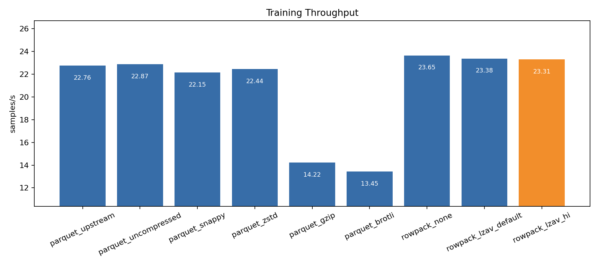
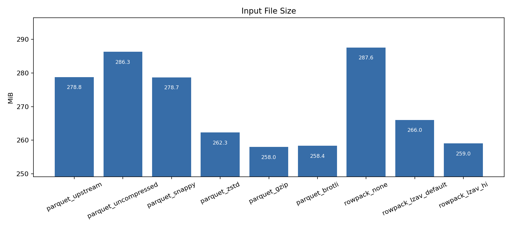
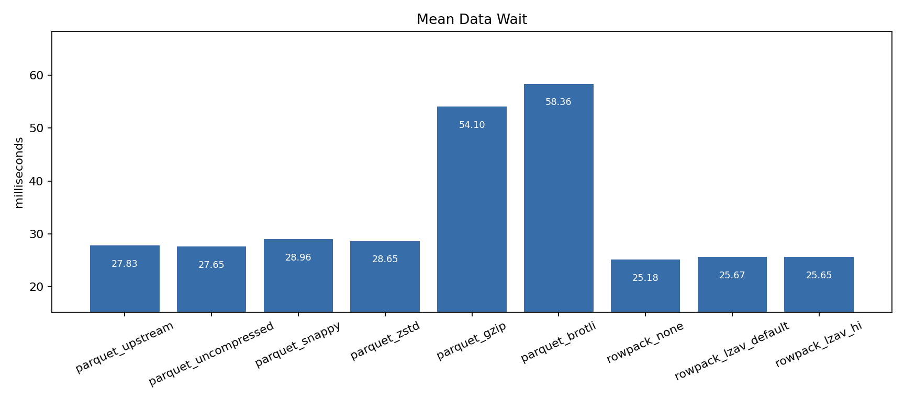

# RowPack





RowPack is a row-major dataset container for multimodal training workloads.
It is built for the pattern VLM training usually wants: sample a random window,
read a small block of neighboring rows, decode images, tokenize text, and feed
the batch without spending most of the step waiting on the loader.

Parquet is excellent for analytics, column scans, and ecosystem compatibility.
RowPack aims at a different hot path: training-time row/window access.

## Why It Is Useful

- Row-major blocks match random-block training access better than column-major
  files.
- CISTA cast-mode payloads avoid rebuilding large Python dictionaries on the
  fast path.
- LZAV block compression gives good size reduction with very fast decompression.
- Native STB image decode can return packed RGB buffers directly to Python.
- QOI lossless image storage is available for image-source experiments where
  lossless decoded RGB storage is useful.
- The Python loader can hand back ready-to-shape byte buffers, so users can go
  straight to `np.frombuffer(...).reshape(h, w, c)` or a tensor conversion.

In the current `mm_infographic_vqa` random-block benchmark, RowPack with LZAV
high-ratio blocks compresses close to Parquet GZIP/Brotli size while keeping
throughput near the uncompressed row-major baseline and well ahead of the
slower Parquet codecs.

## Batteries Included

The native build is self-contained under `rowpack/third_party`:

- `nanobind` for Python bindings
- `cista` for cast-mode payload serialization
- `lzav` for block compression
- `stb` for JPEG/PNG/etc. image decoding
- `qoi` for QOI lossless image payload experiments

## Build

If this directory is the repository root:

```bash
cmake -S . -B build
cmake --build build --config Release
```

From a parent checkout that contains the `rowpack/` directory:

```bash
cmake -S rowpack -B rowpack_build_py
cmake --build rowpack_build_py --config Release
```

CMake uses its normal `FindPython` flow and is configured to prefer the active
virtualenv or PATH Python. Check the `Found Python:` line during configure; the
native module is Python-version-specific. If CMake picks a different Python
than the one that will run your training code, point it at the one you want:

```bash
cmake -S rowpack -B rowpack_build_py -DPython_EXECUTABLE=<python-executable>
cmake --build rowpack_build_py --config Release
```

Then pass the build output directory to converter and benchmark commands:

```bash
--rowpack-native-dir rowpack_build_py/Release
```

You can also set `ROWPACK_NATIVE_DIR=rowpack_build_py/Release`. Most RowPack
Python APIs will discover the native module from that environment variable or
from common local build directories.

## Convert Parquet To RowPack

Recommended first conversion for a JPEG/JFIF-heavy VLM dataset:

```bash
python benchmarks/prepare_mm_infographic_vqa_rowpack.py \
  --data-files data/variants/mm_infographic_vqa/uncompressed.parquet \
  --output-dir data/variants/mm_infographic_vqa_rowpack \
  --variant-name rowpack_cista_lzav_hi \
  --rows-per-block 32 \
  --payload-format cista \
  --image-storage encoded \
  --block-codec lzav_hi \
  --rowpack-native-dir rowpack_build_py/Release \
  --overwrite
```

Those defaults mean:

- `payload-format cista`: choose how each row is serialized inside RowPack.
  `json` is easy to inspect and useful for debugging. `cista` is the fast path:
  it stores typed native payloads that the C++ extension can read directly,
  avoiding a lot of Python object reconstruction during training.
- `image-storage encoded`: keep the source JPEG/PNG/WebP bytes instead of
  expanding images inside the file.
- `block-codec lzav_hi`: choose block compression. Options are `none`,
  `lzav_default`, and `lzav_hi`. `none` is the pure layout baseline,
  `lzav_default` favors faster conversion, and `lzav_hi` spends more time while
  writing to get the smallest RowPack files. `lzav_hi` is the recommended
  default for dataset publishing; both LZAV modes are designed for very fast
  decompression during training.
- `rows-per-block 32`: compresses 32 rows into one block, a good default to
  balance compression ratio with shuffled random-window read performance.

For lossless image-codec experiments, use:

```bash
--image-storage qoi_lossless
```

That decodes the source image once during conversion, stores QOI, and returns
packed RGB through the native direct-VQA path. Use this mainly when the source
images are lossless: RowPack re-encodes the decoded image losslessly using QOI,
which has PNG-like compression behavior but is much faster to encode/decode.

## Read From Python

Generic row reconstruction:

```python
from rowpack import RowPackReader

with RowPackReader("data/variants/mm_infographic_vqa_rowpack/rowpack_cista_lzav_hi.rowpack") as reader:
    row = reader.read_row(0)
```

PyTorch list-file loader:

```python
from torch.utils.data import DataLoader
from rowpack import RowPackBlockDataset, RowPackLoaderState

dataset = RowPackBlockDataset(
    "data/variants/mm_infographic_vqa_rowpack/rowpacks.txt",
    mode="shuffle",
    return_format="native_vqa",
    state=RowPackLoaderState(file_index=0, block_index=0, seed=123),
)

loader = DataLoader(dataset, batch_size=16, num_workers=2, collate_fn=lambda batch: batch)

for batch in loader:
    row_id, text_pairs, images = batch[0]
    ...
```

The list file is plain text, one `.rowpack` path per line. In `sequential`
mode, `file_index` and `block_index` are the exact next list line and block. In
`shuffle` mode, those two values are deterministic counters mixed with `seed`
to choose a reproducible pseudo-random RowPack file and block. Rows are always
read sequentially inside a selected block.

Fast VQA iteration without `DataLoader`:

```python
from rowpack import RowPackBlockDataset

rows = RowPackBlockDataset(
    "data/variants/mm_infographic_vqa_rowpack/rowpacks.txt",
    mode="shuffle",
    return_format="native_vqa",
    seed=123,
)

for row_id, text_pairs, images in rows:
    image = images[0]
    # image["bytes"] is packed RGB when native STB/QOI decode succeeds.
    # Use np.frombuffer(image["bytes"], dtype=np.uint8).reshape(h, w, c).
```

## Benchmark

```bash
python benchmarks/run_mm_infographic_vqa_parquet_suite.py \
  --manifest data/variants/mm_infographic_vqa_rowpack/manifest.json \
  --loader rowpack \
  --rowpack-native-dir rowpack_build_py/Release \
  --read-pattern random_block \
  --read-block-size 32 \
  --steps 20 \
  --warmup-steps 2 \
  --max-rows 256 \
  --batch-size 1 \
  --num-workers 0 \
  --sequence-length 128 \
  --image-size 32 \
  --output-dir results/mm_infographic_vqa_rowpack
```

The benchmark writes Markdown/CSV summaries and chart PNGs under the output
directory.

Example results on `nimapourjafar/mm_infographic_vqa`, using random-block
access, 32-row windows, 8,192 reproducibly sampled rows, 100 warmup steps, and
1,000 measured CPU training-loop steps:

| variant | size | samples/s | data wait |
| --- | ---: | ---: | ---: |
| parquet_uncompressed | 286.33 MiB | 22.99 | 27.65 ms |
| parquet_zstd | 262.27 MiB | 22.47 | 28.65 ms |
| parquet_gzip | 258.02 MiB | 14.28 | 54.10 ms |
| parquet_brotli | 258.37 MiB | 13.46 | 58.36 ms |
| rowpack_none | 287.59 MiB | 24.13 | 25.18 ms |
| rowpack_lzav_default | 266.04 MiB | 23.89 | 25.67 ms |
| rowpack_lzav_hi | 259.03 MiB | 23.88 | 25.65 ms |



## Use With nanoVLM

Create a RowPack list file:

```text
data/variants/mm_infographic_vqa_rowpack/rowpack_cista_lzav_hi.rowpack
```

Then point `train.py` at that list:

```bash
python train.py \
  --rowpack_list data/variants/mm_infographic_vqa_rowpack/rowpacks.txt \
  --rowpack_read_mode shuffle \
  --rowpack_seed 123 \
  --batch_size 1 \
  --gradient_accumulation_steps 1 \
  --no_log_wandb
```

For a quick CPU-only integration check without downloading pretrained
backbones:

```bash
python train.py \
  --rowpack_list data/variants/mm_infographic_vqa_rowpack/rowpacks.txt \
  --rowpack_read_mode shuffle \
  --rowpack_seed 123 \
  --rowpack_max_rows 256 \
  --dataloader_num_workers 0 \
  --max_training_steps 1 \
  --batch_size 1 \
  --gradient_accumulation_steps 1 \
  --val_size 8 \
  --no_log_wandb \
  --no_eval \
  --no_lmms_eval \
  --tiny_debug_model
```

The production path uses the same RowPack loader; omit `--tiny_debug_model` to
train the configured nanoVLM model.

## Current Format Notes

The v0 block index stores:

- start row and row count
- file offset
- compressed size
- uncompressed size
- codec id

For uncompressed blocks, row offsets are absolute file offsets for backward
compatibility. For compressed blocks, row offsets are relative to the
decompressed block.

Planned additions include checksums, append/update utilities, a dedicated JPEG
writer path, and more image-specific storage modes.
